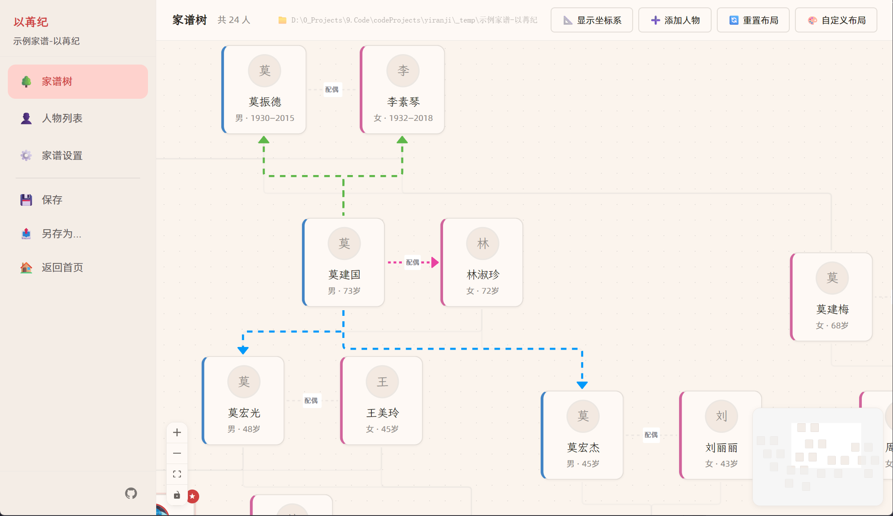

# 以苒纪 (yiranji)

> **光阴在苒，世家成纪。**

"以苒纪"取自"光阴在苒，世家成纪"——以苒（时光流转）为纪，记录家族世代的延续与传承。

这是一款现代化的家谱管理桌面应用，基于 Tauri v2 + React 构建，支持人员档案管理、家族树可视化、农历转换等功能。

## 预览

### 首页


### 家族树



## 功能特性

- **人员档案** — 管理家族成员信息，支持头像、生卒日期、出生地、生肖、农历等
- **家族树** — 可视化展示家族关系，支持缩放、拖拽、节点交互
- **农历支持** — 基于 `lunar-javascript` 库，自动计算农历日期与生肖
- **行政区划联动** — 内置全国省/市/县/乡镇四级数据，出生地选择更便捷
- **本地存储** — 数据存储在本地，无需联网

## 项目结构

```
yiranji/
├── src-tauri/          # Tauri / Rust 后端
│   └── icons/          # 应用图标
├── src/
│   ├── components/     # 公共组件
│   ├── pages/          # 页面组件
│   ├── store/          # Zustand 状态管理
│   ├── utils/          # 工具函数
│   └── index.css       # 全局样式 & 设计系统
├── public/fonts/       # 本地字体文件
├── scripts/            # 构建辅助脚本
├── VERSION             # 版本号文件（单一修改入口）
└── tauri.conf.json     # Tauri 配置
```

## 开发环境要求

- **Node.js** >= 18
- **Rust** >= 1.77（用于 Tauri 编译）
- **npm** 或其他包管理器

> 如果不打算打包发布，可以跳过 Rust 环境，仅运行前端开发服务器。

## 快速开始

```bash
# 安装依赖
npm install

# 启动开发模式
npm run tauri dev

# 打包构建
npm run tauri build
```

### 仅前端开发（无需 Rust）

```bash
# 只启动 Vite 前端开发服务器
npm run dev
```

## 版本号管理

版本号统一在根目录的 [`VERSION`](./VERSION) 文件中维护。运行 `npm run tauri dev` 或 `npm run tauri build` 时会自动同步到：

- `package.json` 的 `version` 字段
- `src-tauri/Cargo.toml` 的 `version` 字段
- `src-tauri/tauri.conf.json` 的 `version` 字段

> 版本号必须符合 semver 格式（如 `26.7.2`，不要写成 `2026.07.02`），前面不要使用0，最大不能超过255。

## 构建产物

打包后的安装包位于 `src-tauri/target/release/bundle/nsis/` 目录下。

## 鸣谢

- **行政区划数据** — 来自 [xiangyuecn/AreaCity-JsSpider-StatsGov](https://github.com/xiangyuecn/AreaCity-JsSpider-StatsGov)，包含省/市/县/乡镇四级数据
- **农历转换** — [lunar-javascript](https://github.com/6tail/lunar-javascript)
- **字体** — [霞鹜文楷](https://github.com/lxgw/LxgwWenKai) · [阿里巴巴普惠体](https://fonts.alibabagroup.com/)

## License

[MIT](./LICENSE)
